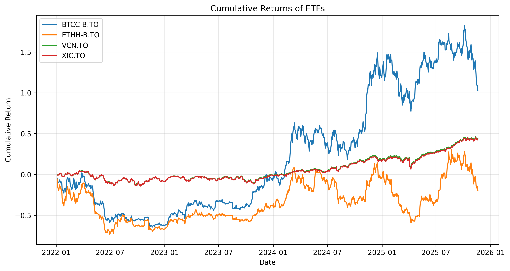
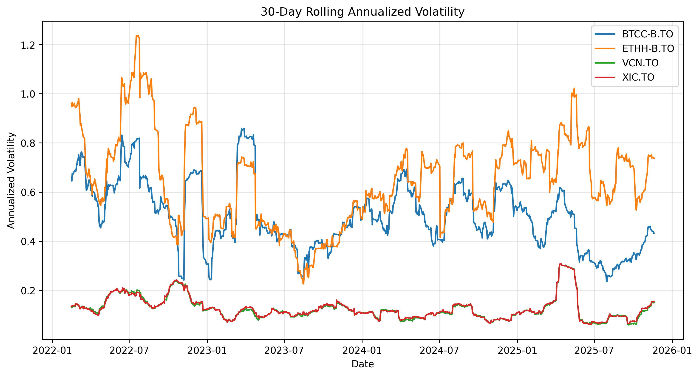
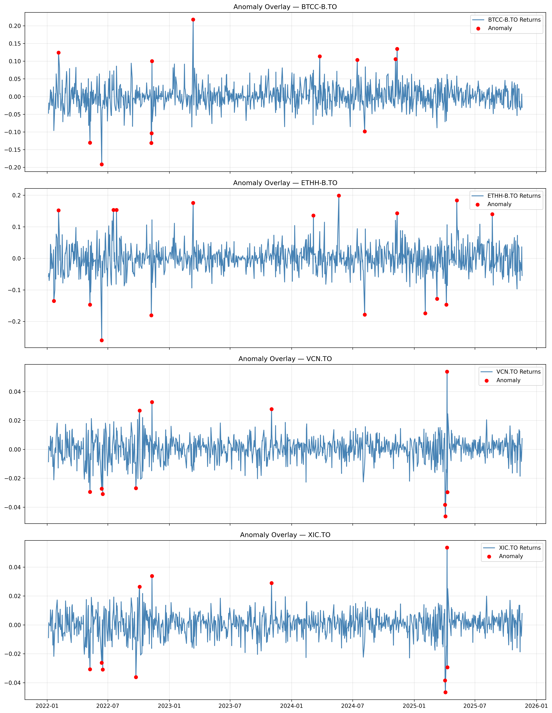
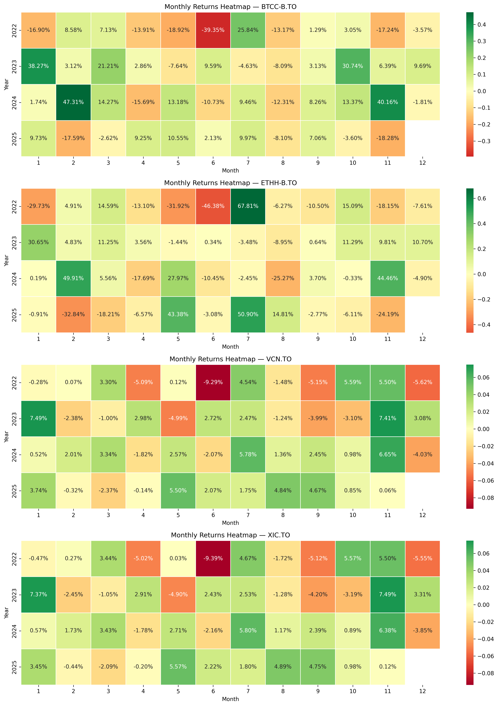

# 📈 ETF Automated Reporting Pipeline  
### Automated Data Pipeline for ETF Performance, Risk, and Anomaly Detection (Python)

This project is an **end-to-end automated data analytics pipeline** that downloads ETF market data, cleans and structures it, computes financial KPIs, detects anomalies, generates visualizations, and exports a full reporting package.

The design follows a **modular, production-style architecture**, similar to reporting workflows used in financial institutions.

---

## 🚀 Features

### ✔ Automated data ingestion  
Downloads historical OHLC price data for multiple ETFs using `yfinance`.

### ✔ Data cleaning & transformation  
- Extracts structured close-price datasets  
- Computes *daily returns*  
- Computes *monthly returns* using `"ME"` month-end resampling  
- Saves cleaned datasets for downstream analysis

### ✔ Financial KPIs  
Calculated metrics include:
- Cumulative returns  
- Annualized volatility  
- Maximum drawdown  
- Year-to-date (YTD) return  
- Rolling 30-day volatility  

### ✔ Anomaly detection  
Using z-scores (`|z| > 3`), the pipeline identifies outlier return events and generates:
- A full anomaly dataset  
- A per-ETF anomaly summary with best/worst daily returns  

### ✔ Automated reporting  
Exports:
- `KPI_Summary.xlsx`  
- `Anomaly_Summary.xlsx`  
- All charts (PNG):
  - Cumulative returns  
  - Drawdown curves  
  - Rolling volatility  
  - Heatmaps  
  - Anomaly overlays  

---

## 📊 ETF Universe Analyzed

- **VCN.TO** — Vanguard FTSE Canada Index  
- **XIC.TO** — iShares Core S&P/TSX Composite Index  
- **BTCC-B.TO** — Purpose Bitcoin ETF  
- **ETHH-B.TO** — Purpose Ethereum ETF  

This selection mixes traditional equity ETFs with crypto ETFs, highlighting contrasting behaviors in volatility and drawdowns.

---

## 🧱 Project Structure

<pre><code>
main.py
config.yaml

src/
    data_ingestion.py
    data_cleaning.py
    kpi_calculations.py
    anomaly_detection.py
    reporting.py

data/
    raw/
    clean/

output/
    charts/
    final_report/
</code></pre>

  
---

## 🛠️ How to Run the Pipeline

### 1. Install dependencies

pip install -r requirements.txt

### 2. Run the automated pipeline

python main.py

All final reports and charts will be generated in:

output/final_report/
output/charts/

---

## 📘 Jupyter Notebook (Full Walkthrough)

For exploration, visual explanations, and step-by-step analysis:

👉 **[View the Analysis Notebook](./automated_etf_reporting.ipynb)**  

---

## 📄 Downloadable Reports

- 📊 **[KPI Summary](output/final_report/KPI_Summary.xlsx)**  
- ⚠️ **[Anomaly Summary](output/final_report/Anomaly_Summary.xlsx)**  

These files are automatically generated by the pipeline.

---

# 📈 Visual Outputs

Below are examples of the charts generated by the pipeline.

### 📈 Cumulative Returns  

---

### 📉 Drawdown Curves  

---

### 📉 Rolling 30-Day Volatility  

---

### 🔎 Anomaly Overlay  

---

### 🗓 Monthly Returns Heatmaps  

---

## 📊 Power BI Dashboards

This project includes an automated Power BI reporting layer that updates directly from the Python pipeline outputs.
All reports are generated using parameterized connections, allowing Power BI Desktop to refresh the data daily without manual intervention.

Below are the dashboards included in the /Dashboard folder.

📁 Download the Interactive Power BI Report
🔗 Pipeline_ETF_dashboard.pbix

This is the fully–interactive Power BI report used in the project.
You can open it in Power BI Desktop to explore all visuals, filters, and automated connections.

## 🖼️ Dashboard Previews
### 1️⃣ ETF Performance Overview Dashboard
📸 Preview
🔗 Open full image:
View ETF_performance_overview.png

Description

This dashboard provides a high-level performance analysis of the selected ETFs, including:

Price Trend comparison

Year-to-Date (YTD) Return

Annualized Volatility

Maximum Drawdown

Monthly Returns Trend

Dynamic filters for ETF selection and Date range

All metrics update automatically according to the outputs generated by the Python pipeline.

### 2️⃣ Risk Analysis Dashboard
📸 Preview
🔗 Open full image:
View Risk_analysis.png

Description

This dashboard focuses on understanding the risk profile of each ETF:

Risk vs Return Scatter Plot (Volatility vs YTD Return)

Daily Returns Trend

Distribution of Daily Returns (Histogram)

Monthly Returns Heatmap

All visuals dynamically adapt to selected ETFs and dates

This view highlights volatility behavior, return dispersion, and monthly performance patterns.

### 🧪 ETF Coverage Clarification

Originally, the automated Python pipeline was configured to analyze four ETFs as a minimal working example.
However, the Power BI reporting layer is fully flexible:

✔️ The pipeline.yml allows you to run the pipeline with any list of tickers
✔️ The Power BI dashboards visualize any ETFs included in the latest pipeline run

This means the datasets powering the dashboards may include different ETFs depending on your most recent pipeline execution.

The system is fully dynamic and supports:

Adding or removing ETFs

Switching to different markets

Running ad-hoc analyses over custom tickers

---
## 🔗 End-to-End Architecture Summary

Python pipeline extracts, cleans, computes KPIs, and exports updated CSV/XLSX files

Outputs follow a structured folder format (clean/ and final_report/)

Power BI connects using a BaseFolderPath parameter, ensuring automated refresh

Dashboards always reflect the most recent market data

---

## 🔍 Skills Demonstrated

- Python (Pandas, NumPy, Matplotlib, Seaborn, SciPy)  
- Financial analytics: volatility, drawdown, returns  
- Anomaly detection and risk analysis  
- Data engineering & pipeline automation  
- Modular software design (multi-file architecture)  
- YAML configuration  
- Reporting automation  
- Data visualization best practices  

---

## 👩🏻‍💻 Author

**Mayerlin Díaz**  
Data Analyst • Python • Financial Analytics  

---

